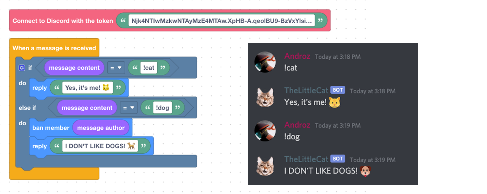

# [Scratch For Discord](https://scratch-for-discord.netlify.com)

🐱 Make your Discord bot using Scratch blocks! [Scratch For Discord](https://scratch-for-discord.netlify.com) is an advanced fork of [discord-blocks](https://discordblocks.leondrolio.com/). Thanks to [7coil](https://github.com/7coil) for her great work!

## Features

* 🖥️ No code knowledge required!  
* ⏩ Make a bot in less than 2 minutes!  
* 🧪 Start and test your bot directly on the site!
* 🇫🇷 French is supported!

## Example

## Installation

To run Scratch For Discord, follow these steps:

* Clone the project. Run `git clone https://github.com/Androz2091/scratch-for-discord`.
* Run `yarn install` to install project dependencies.
* Run `yarn start` to start the development server.
* Go to `http://localhost:3000`!

## Desktop App
**[Click Here](https://github.com/DevSnowflake/scratch-for-discord)** to download desktop version of **scratch-for-discord**.

## Credits

* Discord.js ([discordjs/discord.js](https://github.com/discordjs/discord.js))
* Blockly ([google/blockly](https://github.com/google/blockly))
* And, of course, Discordblocks ([7coil/discordblocks](https://github.com/7coil/discord-blocks))
